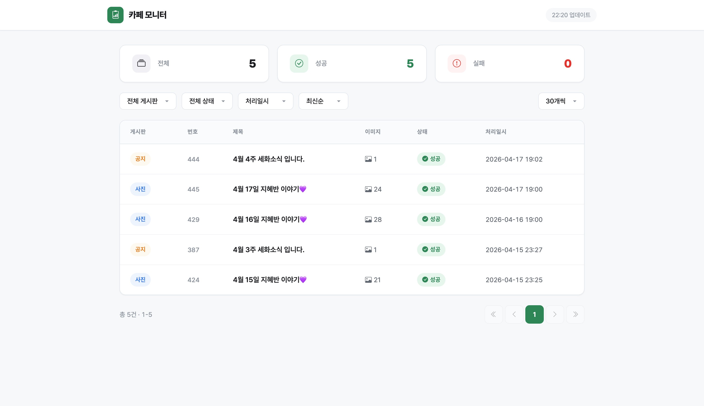
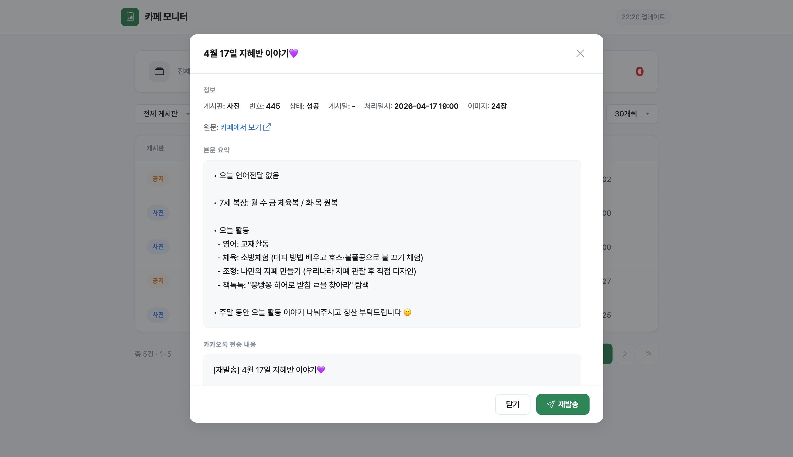
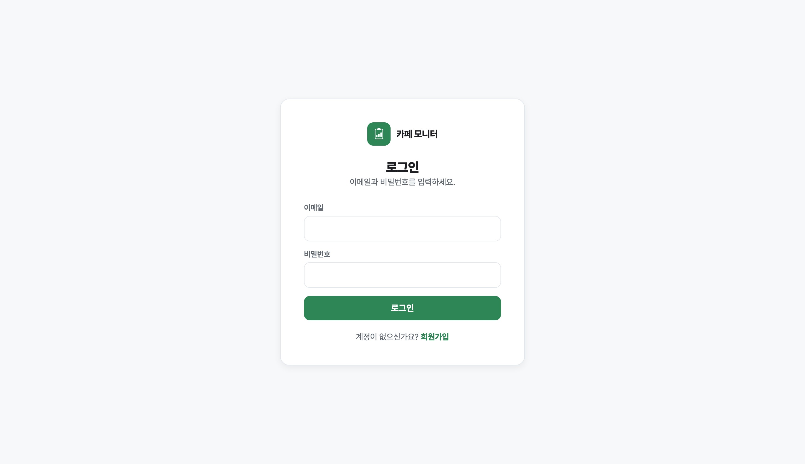
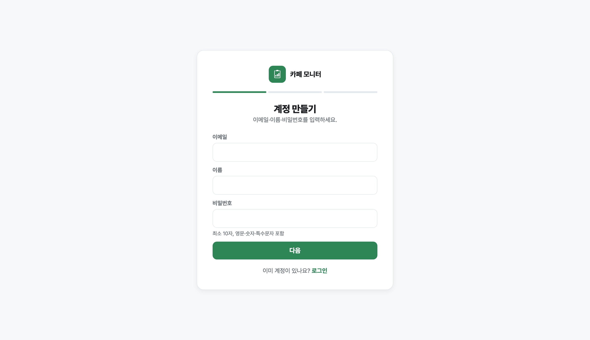

# naver-cafe-monitor

> 세화유치원 네이버 카페 모니터링 시스템 — 배치 크롤링 + REST API + 웹 대시보드

---

## 화면

| 대시보드 | 상세 모달 |
|:--------:|:---------:|
|  |  |

| 로그인 | 회원가입 |
|:------:|:--------:|
|  |  |

---

## 기능 요약

| 컴포넌트 | 역할 |
|----------|------|
| **Batch** | 30분 주기 크롤링 → 얼굴 필터링 → AI 요약 → 카카오톡 알림 |
| **API** | 처리 이력 조회 + Google 관리자 로그인 REST API (FastAPI/Uvicorn) |
| **Web** | 처리 이력 대시보드 — 통계, 필터, 페이지네이션, 상세 모달(카카오 전송 내용 미리보기·재발송) + Google 로그인 (Astro SSR) |
| **Auth** | Google OAuth 관리자 로그인, 이메일·이름 AES-GCM + HMAC, JWT + Refresh Rotation, mTLS 외부 차단 |

### 배치 파이프라인

| 게시판 | 파이프라인 | 대상 필터 |
|--------|-----------|----------|
| 사진게시판 (`menus/13`) | 이미지 다운로드 → 얼굴 인식 필터링 → Google Photos 업로드 → sonnet 요약 → 카카오톡 전송 | 기준 얼굴 매칭 |
| 공지사항 (`menus/6`) | 이미지 2+3등분 병렬 분석 (opus) → 내용/일정 분리 전송 | 7세 또는 전체 대상만 |

---

## 아키텍처

```
   브라우저
     │
     └──(mTLS) ──→  ncm.<internal-host>          (*.eepp.shop, 외부 차단)
                  │
                  ▼
               nginx (443, Let's Encrypt)
                  │
                  ├─ /api/*  ─→ uvicorn (127.0.0.1:8000)  ─→ MySQL (SSL/X509)
                  └─ /*      ─→ Astro SSR (127.0.0.1:4321)

   [cron 30분] ──→ batch.py
         │
         ├─ menus/13 사진게시판: Playwright → DeepFace 얼굴 필터
         │                     → Google Photos → Claude sonnet 요약
         └─ menus/6  공지사항 : Playwright → Claude opus (2+3등분 병렬)
                              → 대상 필터링(7세/전체)
                                      │
                              카카오톡 메시지 발송 + MySQL 처리 이력
```

### 인증 플로우

```
  [관리자 로그인]  /login → /oauth2/authorization/google
                  → Google OAuth → /login/oauth2/code/google
                  → 허용 이메일 확인 → /admin/posts

  [세션]     JWT access(1h)+refresh(24h) httpOnly Secure Cookie
             Rotation + 재사용 감지 (단일 세션)
             CSRF double-submit
```

---

## 기술 스택

| 분류 | 기술 |
|------|------|
| Backend | Python 3.11+, FastAPI, Uvicorn |
| Frontend | Astro (SSR, @astrojs/node), TypeScript |
| Database | MySQL 8.0 (SSL/X509) |
| Reverse Proxy | nginx (TLS + mTLS) |
| Browser Automation | Playwright (headless Chromium) |
| Face Recognition | DeepFace + dlib |
| AI | Claude Code CLI (opus/sonnet) |
| Storage | Google Photos API (OAuth) |
| Messaging | 카카오톡 REST API |
| Auth | argon2id · AES-GCM · HMAC-SHA256 · RSA-OAEP · PyJWT |
| Secrets | sops + age |
| Infra | macOS launchd, brew services |

---

## 전제조건

- Python 3.11+
- cmake — dlib 빌드에 필수
- Playwright chromium
- Claude Code CLI

### macOS

```bash
brew install cmake python@3.11
```

### Linux (Ubuntu/Debian)

```bash
apt-get install -y cmake python3-dev
```

---

## 설치 및 실행

```bash
python3.11 -m venv .venv && source .venv/bin/activate
pip install -e ".[dev]"
playwright install chromium
cp .env.example .env
cp config/config.example.yaml config/config.yaml
```

얼굴 기준 이미지 등록:

```bash
python -m src.face.cli register data/faces/reference/photo.jpg --label "이름"
```

수동 실행:

```bash
python -m src.batch
```

---

## 환경변수 (`.env.enc` — sops + age 암호화)

실제 값은 sops 로 암호화되어 `.env.enc` 에 저장. 관리자에게 별도 문의.

| 변수명 | 설명 |
|--------|------|
| `NAVER_ID` / `NAVER_PW` | 네이버 로그인 |
| `KAKAO_CLIENT_ID` / `KAKAO_CLIENT_SECRET` | 카카오 OAuth |
| `MYSQL_PASSWORD` | MySQL 접속 비밀번호 |
| `CONFIG_PATH` / `LOG_LEVEL` | 앱 설정 |
| `AUTH_RSA_PRIVATE_KEY` / `AUTH_RSA_PUBLIC_KEY` | RSA-2048 keypair (E2E 필드 암호화) |
| `AUTH_AES_KEY` | AES-256 (이메일/이름 암호화) |
| `AUTH_HMAC_KEY` | 이메일 룩업 HMAC 인덱스 |
| `AUTH_JWT_SECRET` | JWT 서명 |
| `GOOGLE_CLIENT_ID` / `GOOGLE_CLIENT_SECRET` | Google OAuth 관리자 로그인 |
| `GOOGLE_ADMIN_ALLOWED_EMAILS` | 관리자 접근 허용 Google 이메일 목록 (콤마 구분) |
| `GOOGLE_OAUTH_REDIRECT_URI` | 선택. proxy prefix가 있는 운영 callback URI 고정 |

시크릿 생성 · 주입:

```bash
.venv/bin/python scripts/auth/generate_secrets.py          # 최초 1회
INITIAL_ADMIN_EMAIL=<email> INITIAL_ADMIN_PASSWORD=<pw> \
  INITIAL_ADMIN_NAME=Admin \
  .venv/bin/python scripts/auth/seed_admin.py              # 최초 관리자 1회
```

---

## 설정 (`config/config.yaml`)

| 섹션 | 주요 항목 |
|------|----------|
| `cafe` | 카페 ID, 게시판 목록 (`menus/13`, `menus/6`) |
| `face` | 유사도 임계값 (`tolerance: 0.55`), 기준 이미지 경로 |
| `notification` | 카카오 수신자 (본인, 배우자) |
| `summary` | AI 모델, 최대 토큰 |
| `retry` | 재시도 횟수, 지수 백오프 |

---

## 배치 실행 (cron)

```bash
bash batch/scripts/install_cron.sh           # 설치 (batch + kakao-refresh)
bash batch/scripts/install_cron.sh --uninstall=refresh   # refresh 엔트리만 제거
bash batch/scripts/install_cron.sh --uninstall=batch     # batch 엔트리만 제거
bash batch/scripts/install_cron.sh --uninstall=all       # 전체 제거 (기본값)
```

등록되는 두 엔트리:

| 엔트리 | 주기 | 역할 |
|--------|------|------|
| `batch` | `*/30 * * * *` | 카페 크롤링 + 카톡 발송 |
| `kakao-refresh` | `15 */3 * * *` | 카카오 access/refresh token 선제 갱신 (3시간 주기) |

로그 경로:
- `batch/logs/batch.log`
- `batch/logs/kakao_refresh.log` (토큰 원문은 자동 마스킹)

---

## 수동 로그인 절차

네이버 카페는 쿠키 기반 인증을 사용한다. 쿠키 만료 시:

1. `python -m src.crawler.login` 실행
2. Playwright 브라우저가 열리면 네이버 수동 로그인
3. 로그인 완료 후 쿠키가 자동 저장됨

---

## 배포 (macOS 네이티브)

Mac Mini (`eepp.shop`)에서 Docker 없이 brew + launchd로 운영한다.

### 서비스 구성

| 서비스 | 실행 방식 | 포트 | 관리 |
|--------|-----------|------|------|
| MySQL 8.0 | `brew services` | 3306 | `brew services restart mysql@8.0` |
| nginx | launchd | 80, 443 | `sudo nginx -s reload` |
| API (uvicorn) | launchd | 8000 | `kill <pid>` + 재실행 (sops exec-env) |
| Web (Astro SSR / Node) | `node web/dist/server/entry.mjs` | 4321 | `kill <pid>` + 재실행 |

### SSL/mTLS

- nginx: TLS 종단 + 클라이언트 인증서 검증 (mTLS)
- MySQL: `require_secure_transport=ON`, X509 클라이언트 인증

### 라우팅

```
https://ncm.<internal-host>/api/*          → 127.0.0.1:8000  (uvicorn)
https://ncm.<internal-host>/*              → 127.0.0.1:4321  (Astro SSR)
https://ncm.<external-host>/api/*          → 127.0.0.1:8000  (uvicorn)
https://ncm.<external-host>/*              → 127.0.0.1:4321  (Astro SSR)
http://*                                   → 301 → https
```

`nginx.conf` 는 `deploy/nginx-conf/` 의 샘플 참고. 실제 호스트명은 관리자에게 별도 문의.

### Web 빌드 & 배포

```bash
cd web && npm ci && npm run build
# dist/client (정적 자산) + dist/server (SSR 엔트리) 생성
# Astro Node 서버 재시작:
pkill -f 'dist/server/entry.mjs' ; nohup node dist/server/entry.mjs > /tmp/astro.log 2>&1 &
```

### API 재기동 (sops env 주입)

```bash
pkill -f 'uvicorn api.src.main'
nohup .venv/bin/python scripts/deploy/run_api.py > /tmp/uvicorn.log 2>&1 &
```

`run_api.py` 는 `.env.enc` 를 subprocess 로 복호화 → `os.environ` 주입 → `uvicorn` 을 `execvp` 로 실행.

### 자동 배포 (GitHub Actions + self-hosted runner)

`main` 브랜치에 머지되면 GitHub Actions가 Mac Mini의 self-hosted runner에서 배포 스크립트를 실행한다.

표준 구조:

- 워크플로: `.github/workflows/deploy.yml`
- 서버 배포 스크립트: `scripts/deploy/mac_mini_deploy.sh`
- API 실행 래퍼: `deploy/scripts/run-api.sh`

필수 GitHub 설정:

- Repository variable `DEPLOY_REPO_DIR`: 맥미니에서 이 저장소가 실제로 위치한 절대 경로
- Self-hosted runner labels: `self-hosted`, `macOS`, `deploy`
- Runner 설치 절차: `docs/deploy/github-runner.md`

배포 스크립트가 하는 일:

1. 서버 작업 트리가 깨끗한지 확인
2. 현재 API 프로세스가 실행 중인지 확인
3. `git pull --ff-only origin main`
4. `cd web && npm ci && npm run build`
5. API 재기동
6. Astro SSR 서버 재기동

이 구조는 다른 프로젝트에도 그대로 복제 가능하며, 각 저장소는 `scripts/deploy/mac_mini_deploy.sh` 만 프로젝트 실행 방식에 맞게 바꾸면 된다.

### Auth DB 스키마 적용 (최초 1회)

```bash
mysql -h <host> -u <user> -p <database> < db/migrations/20260417_auth_schema.sql
```

---

## 프로젝트 구조

```
naver-cafe-monitor/
├── api/                    # FastAPI 백엔드
│   ├── src/main.py         # API 진입점 (uvicorn)
│   ├── src/auth/           # 인증 (router, dependencies, cookies, csrf,
│   │                       #  login_service, signup_service, token_service)
│   ├── requirements.txt
│   └── tests/
├── batch/                  # 배치 크롤러
│   ├── src/
│   │   ├── batch.py        # 배치 진입점
│   │   ├── config.py       # 설정 로더
│   │   ├── crawler/        # 네이버 크롤링 (login, parser, session)
│   │   ├── face/           # 얼굴 인식 (DeepFace, cli, filter)
│   │   ├── messaging/      # 카카오톡 발송
│   │   ├── notice/         # 공지 추출·요약
│   │   ├── scheduler/      # 스케줄러 (pipeline, poller, retry)
│   │   └── storage/        # Google Photos 업로드
│   ├── scripts/            # start.sh, install_cron.sh
│   ├── config/             # config.example.yaml
│   └── tests/
├── web/                    # Astro 프론트엔드 (SSR)
│   ├── src/pages/          # admin/* (대시보드·처리이력·상세) / login / signup / error/*
│   ├── src/components/     # admin/(AppShell·Sidebar·Topbar·Modal) + primitives/(Button·Input·Select·Pill·Icon·DataTable·PageHeader·Pagination·HelpTip)
│   ├── src/islands/        # modal·helptip·resend-cooldown (바닐라 TS)
│   ├── src/styles/         # tokens.css (oklch 디자인 토큰) + globals.css
│   ├── tests/e2e/          # Playwright + axe 접근성
│   ├── src/middleware.ts   # 인증 가드 (액세스 쿠키 검증)
│   ├── src/lib/            # auth-client, public-paths
│   ├── astro.config.mjs
│   └── package.json
├── shared/                 # API·배치 공통 모듈
│   ├── database.py         # MySQL SSL 연결
│   ├── post_repository.py  # DB 쿼리
│   ├── user_repository.py  # users DAO
│   ├── refresh_token_repository.py
│   ├── crypto.py           # AES-GCM / HMAC / argon2id / RSA-OAEP
│   ├── auth_tokens.py      # JWT 발급·검증
│   ├── auth_events.py      # 인증 이벤트 로그
│   ├── rate_limit.py       # IP + 계정 rate limit
│   └── kakao_format.py     # 카카오톡 메시지 재구성 (API·batch 공용)
├── scripts/auth/           # generate_secrets.py, seed_admin.py
├── deploy/                 # 배포 설정 참고용
│   ├── docker-compose.yaml
│   ├── nginx-conf/
│   └── db-init/
├── db/                     # DDL, 마이그레이션 (auth schema 포함)
├── docs/
│   ├── prd/                # PRD 문서 (기능별)
│   ├── tasks-auth.md       # auth 기능 태스크 트래킹
│   ├── harness-todo.md     # 하네스·보안 후속 과제
│   └── product-todo.md     # 제품 기능 TODO
└── .github/workflows/      # CI (PR 체크)
```
